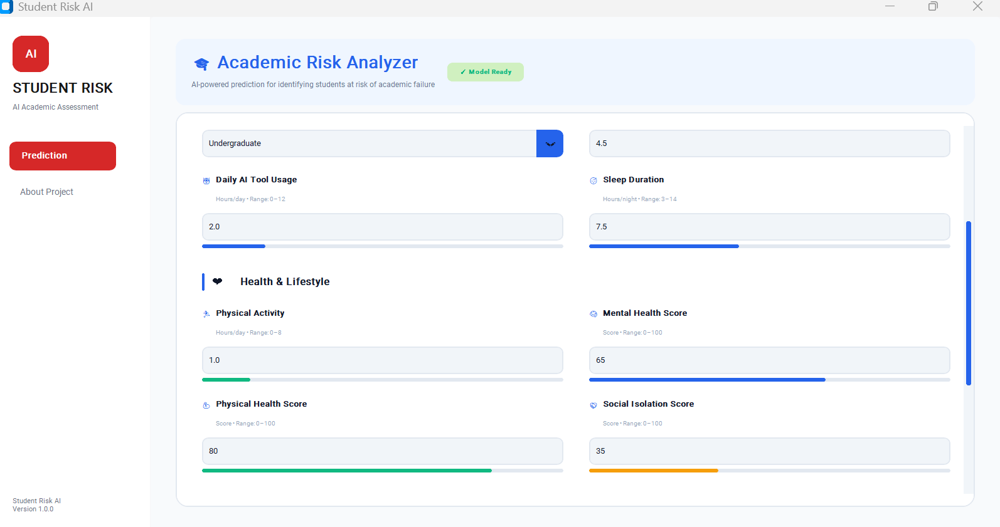
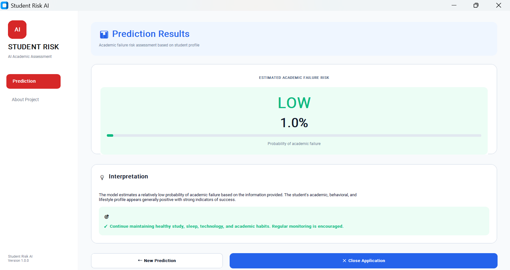
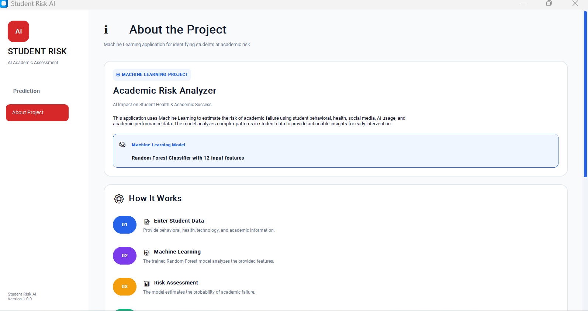
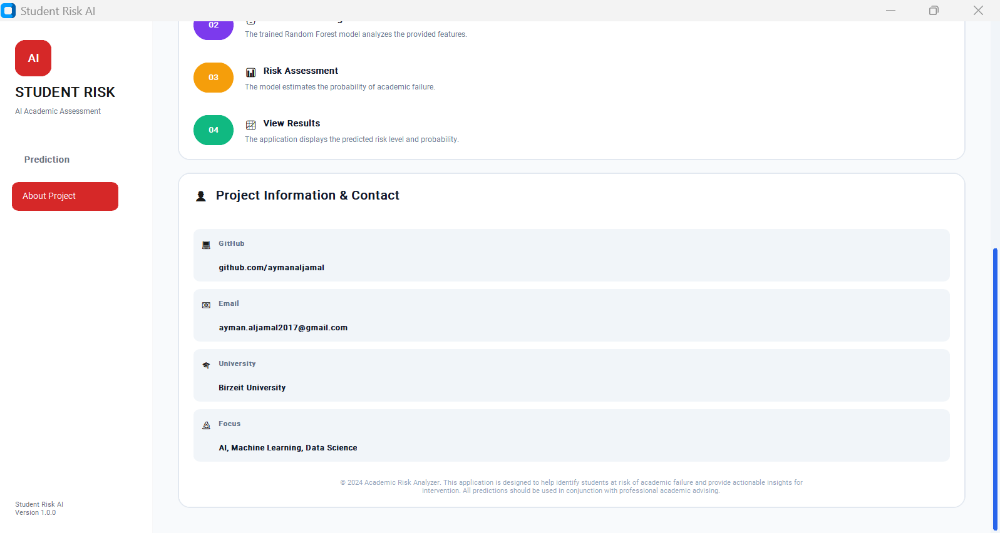

<div align="center">


# AI & Social Media Impact on Student Health & Academic Performance

### Data Analysis, Visualization, Data Cleaning, Machine Learning & Prediction Application

<p>

<a href="https://github.com/aymanaljamal/ai-social-media-student-analysis">
Repository
</a>

  |  

<a href="https://www.kaggle.com/datasets/debayank2024/ai-and-social-media-impact-student-health-and-grades">
Dataset
</a>

  |  

<a href="https://github.com/aymanaljamal/ai-social-media-student-analysis/tree/main/reports/figures">
Visualizations
</a>

</p>

</div>

---

# 📌 Project Overview

This project explores the relationship between **social media usage, AI tool usage, student health, burnout, social isolation, and academic performance**.

The project started as a Data Analysis and Visualization project and has evolved into a complete **end-to-end Machine Learning and prediction application**.

The current system covers:

* Data loading
* Data cleaning
* Exploratory Data Analysis
* Statistical analysis
* Data visualization
* Correlation analysis
* Data preprocessing
* Feature engineering
* Machine Learning
* Model evaluation
* Model saving
* Prediction services
* Prediction input validation
* JSON-based prediction test cases
* High-risk case detection
* Desktop GUI
* PDF report generation
* Project documentation

The project uses Python and common Data Science and Machine Learning libraries to build a structured and reproducible workflow.

---

# 📊 Dataset Overview

The dataset contains:

* **15,000 student records**
* **14 original variables**

The dataset covers several areas related to student life and academic performance:

* Demographic information
* Social media usage
* AI tool usage
* Sleep
* Physical activity
* Mental health
* Physical health
* Social isolation
* Burnout
* Academic performance
* Academic failure risk

The project uses these variables to investigate relationships between student behavior, health, lifestyle, and academic outcomes.

---

# 🎯 Project Goals

The main goal is to understand how students' digital behavior, lifestyle, health, and academic characteristics are related.

The analysis focuses on:

* Daily social media usage
* Daily AI tool usage
* Sleep duration
* Physical activity
* Mental health
* Physical health
* Social isolation
* Burnout
* Academic performance
* Academic failure risk

The Machine Learning objective is to build a classification model capable of predicting:

```text
Academic_Failure_Risk
```

The application objective is to provide a simple interface that allows a user to enter student information and receive a prediction from the trained Machine Learning model.

---

# 🔄 Complete Project Workflow

The project follows a complete Data Science and Machine Learning workflow:

```text
Raw Dataset
     |
     v
Data Loading
     |
     v
Data Exploration
     |
     v
Exploratory Data Analysis
     |
     v
Statistical Analysis
     |
     v
Data Visualization
     |
     v
Correlation Analysis
     |
     v
Data Cleaning
     |
     v
Data Preprocessing
     |
     v
Feature Engineering
     |
     v
Train/Test Split
     |
     v
Machine Learning
     |
     v
Model Evaluation
     |
     v
Model Saving
     |
     v
Prediction Service
     |
     v
Input Validation
     |
     v
Prediction
     |
     v
Prediction Result
     |
     v
Desktop GUI
     |
     v
Test Cases & High-Risk Analysis
     |
     v
PDF Documentation
```

The project is organized into separate modules so that each stage can be maintained, tested, and extended independently.

---

# 📚 Dataset

The project uses the public Kaggle dataset:

**AI & Social Media Impact: Student Health & Grades**

Original dataset:

<a href="https://www.kaggle.com/datasets/debayank2024/ai-and-social-media-impact-student-health-and-grades">
View Dataset on Kaggle
</a>

The original raw dataset is stored locally in:

```text
data/raw/
```

The cleaned dataset is generated and stored in:

```text
data/processed/
```

The original raw dataset is never overwritten by the cleaning process.

---

## Dataset Statistics

| Property              |                   Value |
| --------------------- | ----------------------: |
| Records               |              **15,000** |
| Original Columns      |                  **14** |
| Numerical Variables   |                  **10** |
| Categorical Variables |                   **3** |
| Identifier            |                   **1** |
| Target Variable       | `Academic_Failure_Risk` |

---

# 📋 Dataset Columns

| Column                       | Type        | Description                |
| ---------------------------- | ----------- | -------------------------- |
| `Student_ID`                 | Identifier  | Unique student identifier  |
| `Age`                        | Numerical   | Student age                |
| `Gender`                     | Categorical | Student gender             |
| `Education_Level`            | Categorical | Student education level    |
| `Daily_Social_Media_Hours`   | Numerical   | Daily social media usage   |
| `Daily_AI_Tool_Usage_Hours`  | Numerical   | Daily AI tool usage        |
| `Sleep_Hours`                | Numerical   | Average daily sleep        |
| `Physical_Activity_Hours`    | Numerical   | Daily physical activity    |
| `Mental_Health_Score`        | Numerical   | Mental health score        |
| `Physical_Health_Score`      | Numerical   | Physical health score      |
| `Social_Isolation_Score`     | Numerical   | Social isolation score     |
| `Burnout_Level`              | Categorical | Student burnout level      |
| `Academic_Performance_Score` | Numerical   | Academic performance score |
| `Academic_Failure_Risk`      | Binary      | Academic failure risk      |

---

# 📁 Project Structure

```text
ai-social-media-student-analysis/
│
├── .github/
│   ├── ISSUE_TEMPLATE/
│   │   ├── bug_report.md
│   │   └── feature_request.md
│   │
│   └── PULL_REQUEST_TEMPLATE.md
│
├── app/
│   │
│   ├── assets/
│   │   └── images/
│   │       ├── Home.png
│   │       ├── About.png
│   │       └── Prediction_Low.png
│   │
│   ├── models/
│   │   ├── prediction_request.py
│   │   └── prediction_result.py
│   │
│   ├── services/
│   │   └── prediction_service.py
│   │
│   └── ...
│
├── data/
│   ├── raw/
│   │   └── AI_SocialMedia_Student_Health_Dataset.csv
│   │
│   └── processed/
│       └── AI_SocialMedia_Student_Health_Dataset_clean.csv
│
├── models/
│   ├── random_forest_model.pkl
│   └── preprocessor.pkl
│
├── notebooks/
│   ├── 01_1_data_exploration.ipynb
│   ├── 01_2_data_exploration.ipynb
│   ├── 01_3_data_exploration.ipynb
│   ├── 02_analysis.ipynb
│   └── 03_machine_learning.ipynb
│
├── reports/
│   ├── figures/
│   │   ├── dataset-cover.png
│   │   ├── correlation_heatmap.png
│   │   ├── boxplot_*.png
│   │   ├── distribution_*.png
│   │   └── countplot_*.png
│   │
│   ├── models/
│   ├── metrics/
│   ├── matrices/
│   ├── tables/
│   │
│   ├── test_cases/
│   │   └── prediction_test_cases.json
│   │
│   └── notebooks/
│       ├── 01_1_data_exploration.pdf
│       ├── 01_2_data_exploration.pdf
│       ├── 01_3_data_exploration.pdf
│       ├── 02_analysis.pdf
│       └── 03_machine_learning.pdf
│
├── scripts/
│   └── find_high_risk_cases.py
│
├── src/
│   ├── imports.py
│   ├── data_loader.py
│   ├── data_cleaning.py
│   ├── data_analysis.py
│   ├── visualization.py
│   ├── preprocessing.py
│   ├── train_model.py
│   └── evaluate_model.py
│
├── tests/
│
├── CHANGELOG.md
├── CODE_OF_CONDUCT.md
├── CONTRIBUTING.md
├── LICENSE
├── PROJECT_DOCUMENTATION.md
├── README.md
├── SECURITY.md
├── requirements.txt
├── test.py
└── .gitignore
```

> The structure above highlights the main project components. Additional files may exist inside their respective directories.

---

# 🖥️ Desktop Prediction Application

The project now includes a dedicated desktop GUI built using:

**CustomTkinter**

The GUI provides a user-friendly interface for entering student information and receiving an academic failure risk prediction.

The application separates the presentation layer from the Machine Learning and prediction logic.

---

# 🏠 Home Screen

The Home screen acts as the main entry point to the application.

It provides access to the main prediction workflow and application navigation.



---

# 🔮 Prediction Screen

The Prediction screen allows the user to enter student information including:

* Age
* Gender
* Education Level
* Social media usage
* AI tool usage
* Sleep
* Physical activity
* Mental health
* Physical health
* Social isolation
* Burnout
* Academic performance

After submitting the information, the application processes the input and sends it to the prediction service.



---
# ℹ️ About Screen

The About screen provides information about the project, its purpose, Machine Learning workflow, and the technologies used to build the application.

### About Screen — Overview



### About Screen — Project Information




---

# 🎨 User Interface Design

The application follows a modern **red-and-white visual design**.

The interface focuses on:

* Clean layout
* Simple navigation
* Clear input fields
* Consistent typography
* Clear prediction results
* Input validation
* Reusable UI components
* Responsive grid-based layout
* Modern desktop application styling

---

# 🧠 Prediction Architecture

The prediction functionality is separated from the GUI.

The application follows:

```text
GUI
 |
 v
PredictionRequest
 |
 v
Input Validation
 |
 v
PredictionService
 |
 v
Preprocessor
 |
 v
Random Forest Model
 |
 v
PredictionResult
 |
 v
GUI Result Screen
```

This separation makes the prediction logic reusable independently of the graphical interface.

---

# 📦 Prediction Models

The project uses structured Python models for prediction.

## `PredictionRequest`

Represents the input required by the prediction system.

It contains fields such as:

```text
Student_ID
Age
Gender
Education_Level
Daily_Social_Media_Hours
Daily_AI_Tool_Usage_Hours
Sleep_Hours
Physical_Activity_Hours
Mental_Health_Score
Physical_Health_Score
Social_Isolation_Score
Burnout_Level
Academic_Performance_Score
Uses_AI_Tools
Is_Social_Media_User
Is_Physically_Active
```

## `PredictionResult`

Represents the output returned by the prediction service.

The result contains the prediction information required by the GUI and other application components.

---

# ⚙️ Prediction Service

The prediction business logic is implemented inside:

```text
app/services/prediction_service.py
```

The service is responsible for:

* Loading the trained model
* Loading the preprocessing pipeline
* Preparing prediction input
* Applying the saved preprocessing pipeline
* Running the Random Forest model
* Producing the prediction result
* Returning structured prediction information

The GUI does not directly implement Machine Learning logic.

Instead, it communicates with the prediction service.

---

# ✅ Prediction Validation

The application validates user input before running the Machine Learning model.

Validation includes:

* Required fields
* Age validation
* Score validation
* Hour-based input validation
* Realistic input ranges
* Invalid value handling

Examples include:

* Sleep hours
* Physical activity hours
* Social media hours
* AI tool usage hours
* Mental health score
* Physical health score
* Social isolation score
* Academic performance score

This prevents unrealistic values from being submitted to the prediction system.

---

# 🧪 Prediction Test Cases

The project includes predefined prediction cases stored as JSON.

Location:

```text
reports/test_cases/prediction_test_cases.json
```

These test cases provide reusable student scenarios for validating the prediction workflow.

The JSON-based approach allows prediction cases to be tested without manually entering data through the GUI.

Example structure:

```text
reports/
└── test_cases/
    └── prediction_test_cases.json
```

This also makes it easier to add new prediction scenarios in the future.

---

# 🚨 High-Risk Case Detection

The project includes a dedicated script for analyzing prediction cases and identifying high-risk students.

Script:

```text
scripts/find_high_risk_cases.py
```

Run the script from the project root:

```bash
python scripts/find_high_risk_cases.py
```

The script uses the application prediction components to process predefined prediction cases and identify cases associated with academic failure risk.

Running it from the project root ensures that the `app` package is correctly available to Python.

---

# 🧮 Feature Engineering

The Machine Learning pipeline generates additional derived features:

```text
Uses_AI_Tools
Is_Social_Media_User
Is_Physically_Active
```

## `Uses_AI_Tools`

Indicates whether the student uses AI tools.

## `Is_Social_Media_User`

Indicates whether the student uses social media.

## `Is_Physically_Active`

Indicates whether the student participates in physical activity.

These features convert raw behavioral measurements into additional binary indicators for the Machine Learning pipeline.

---

# 🧹 Data Cleaning

A dedicated cleaning module is implemented in:

```text
src/data_cleaning.py
```

The data loading logic is separated into:

```text
src/data_loader.py
```

The cleaning pipeline includes:

1. Load the raw dataset.
2. Clean column names.
3. Clean text values.
4. Remove duplicate rows.
5. Convert numerical columns.
6. Handle missing values.
7. Validate numerical ranges.
8. Perform final data checks.
9. Save the cleaned dataset.

The processed dataset is stored inside:

```text
data/processed/
```

The original raw dataset is not overwritten.

---

# 🔎 Exploratory Data Analysis

The project performs a detailed inspection of the dataset before Machine Learning.

The analysis includes:

* Dataset dimensions
* Column names
* Data types
* Missing values
* Duplicate records
* Unique values
* Numerical variables
* Categorical variables
* Descriptive statistics
* Correlations
* Distribution analysis
* Target variable analysis

---

# 📈 Descriptive Statistics

For numerical variables, the project analyzes:

* Count
* Mean
* Median
* Minimum
* Maximum
* Standard deviation
* Variance
* Quartiles
* Interquartile range
* Skewness
* Kurtosis

---

# 📊 Data Visualization

Generated visualizations are stored in:

```text
reports/figures/
```

The project includes:

* Correlation heatmaps
* Box plots
* Numerical distribution plots
* Histograms
* Categorical count plots

---

# 🔥 Correlation Heatmap

The correlation heatmap is used to investigate relationships between numerical variables.


The analysis examines relationships involving:

* Social media usage
* AI tool usage
* Sleep
* Mental health
* Physical health
* Social isolation
* Academic performance
* Academic failure risk

---

# 📦 Box Plots

Box plots are used to examine:

* Median
* Quartiles
* Data spread
* Potential outliers

### Age


### Daily Social Media Usage


### Daily AI Tool Usage


### Sleep Hours


### Physical Activity Hours


### Mental Health Score


### Physical Health Score


### Social Isolation Score


### Academic Performance Score


### Academic Failure Risk


---

# 📉 Numerical Distributions

Histograms and distribution plots are used to understand how numerical variables are distributed.

The analysis includes:

* Age
* Daily social media usage
* Daily AI tool usage
* Sleep
* Physical activity
* Mental health
* Physical health
* Social isolation
* Academic performance
* Academic failure risk

---

# 🧑‍🎓 Categorical Analysis

Categorical variables are analyzed using count plots.

## Gender


## Education Level


## Burnout Level


`Student_ID` is treated as an identifier and should not be interpreted as a meaningful categorical feature.

---

# 🤖 Machine Learning

The project includes a complete Machine Learning pipeline for predicting:

```text
Academic_Failure_Risk
```

This is a binary classification problem:

```text
0 → No Academic Failure Risk

1 → Academic Failure Risk
```

The Machine Learning workflow is:

```text
Cleaned Dataset
      |
      v
Feature Engineering
      |
      v
Train/Test Split
      |
      v
Preprocessing
      |
      v
Feature Encoding
      |
      v
Feature Scaling
      |
      v
Random Forest
      |
      v
Model Evaluation
      |
      v
Model Saving
```

---

# ⚙️ Machine Learning Preprocessing

The preprocessing pipeline is implemented in:

```text
src/preprocessing.py
```

The pipeline performs:

* Feature preparation
* Feature engineering
* Train/test splitting
* Numerical preprocessing
* Categorical encoding
* Feature scaling
* Preprocessor fitting

The pipeline uses:

```text
StandardScaler
OneHotEncoder
ColumnTransformer
```

The preprocessing pipeline is fitted only on training data.

This prevents **data leakage** between the training and testing datasets.

---

# ✂️ Train/Test Split

The dataset contains:

```text
Total records:  15,000

Training data:  12,000

Testing data:    3,000
```

An **80/20 train-test split** is used.

The preprocessing pipeline is fitted using the training data and then applied to the testing data.

---

# 🌲 Random Forest Model

The primary Machine Learning model is:

```text
Random Forest Classifier
```

Current configuration:

```text
n_estimators = 100
random_state = 42
class_weight = balanced
```

The `class_weight="balanced"` configuration is used to account for the imbalance between target classes.

---

# 🏋️ Model Training

The training logic is implemented in:

```text
src/train_model.py
```

The training process:

1. Loads the prepared dataset.
2. Prepares features and target.
3. Performs train/test splitting.
4. Fits the preprocessing pipeline using training data.
5. Transforms training and testing data.
6. Creates the Random Forest model.
7. Trains the model.
8. Saves the trained model.
9. Saves the preprocessing pipeline.
10. Returns the required evaluation data.

---

# 📏 Model Evaluation

Model evaluation is implemented in:

```text
src/evaluate_model.py
```

The evaluation stage calculates:

* Accuracy
* Precision
* Recall
* F1-score
* Classification report
* Confusion matrix

Future evaluation stages may include:

* ROC-AUC
* ROC curve
* Precision-Recall curve

---

# 📊 Current Model Results

The Random Forest model was trained on:

```text
12,000 training records
```

and evaluated on:

```text
3,000 test records
```

## Performance Summary

| Metric            |     Result |
| ----------------- | ---------: |
| Accuracy          | **98.47%** |
| Test Records      |  **3,000** |
| Class 0 Recall    |   **1.00** |
| Class 1 Precision |   **0.97** |
| Class 1 Recall    |   **0.77** |
| Class 1 F1-score  |   **0.86** |

---

# 📋 Classification Report

```text
              precision    recall  f1-score   support

           0       0.99      1.00      0.99      2820
           1       0.97      0.77      0.86       180

    accuracy                           0.98      3000
   macro avg       0.98      0.88      0.92      3000
weighted avg       0.98      0.98      0.98      3000
```

The model achieved:

```text
Accuracy = 98.47%
```

---

# 🔲 Confusion Matrix

The current confusion matrix is:

```text
[[2816    4]
 [  42  138]]
```

The model correctly classified:

* **2,816** class-0 students
* **138** class-1 students

The model incorrectly classified:

* **4** class-0 students as class 1
* **42** class-1 students as class 0

The class-1 performance is:

```text
Precision = 0.97

Recall    = 0.77

F1-score  = 0.86
```

---

# ⚠️ Model Performance Interpretation

Although the model achieved a high accuracy of:

```text
98.47%
```

accuracy should not be considered the only important metric.

The target dataset is imbalanced:

```text
Class 0: 2,820 test records

Class 1:   180 test records
```

Therefore, the following metrics are also important:

* Precision
* Recall
* F1-score
* Confusion Matrix
* ROC-AUC

Class-1 recall is particularly important because class 1 represents students identified as being at academic failure risk.

The current model correctly identifies approximately **77% of the actual positive cases**.

---

# 💾 Saved Machine Learning Files

After training, the following files are generated:

```text
models/
├── random_forest_model.pkl
└── preprocessor.pkl
```

## `random_forest_model.pkl`

Contains the trained Random Forest classification model.

## `preprocessor.pkl`

Contains the fitted preprocessing pipeline used to transform data before prediction.

The prediction service reuses these saved artifacts during inference.

---

# 📓 Data Exploration Notebooks

The project contains notebooks documenting the exploratory analysis process.

## `01_1_data_exploration.ipynb`

Focuses on understanding the dataset structure.

Includes:

* Loading the dataset
* Inspecting the dataset
* Checking dimensions
* Viewing column names
* Checking data types
* Viewing sample records
* Identifying numerical columns
* Identifying categorical columns

---

## `01_2_data_exploration.ipynb`

Focuses on statistical and categorical exploration.

Includes:

* Missing-value analysis
* Duplicate analysis
* Unique-value analysis
* Descriptive statistics
* Numerical variable analysis
* Categorical variable analysis
* Distribution inspection

---

## `01_3_data_exploration.ipynb`

Focuses on relationships and visualization.

Includes:

* Correlation analysis
* Correlation heatmaps
* Numerical distributions
* Box plots
* Categorical count plots
* Visual exploration of important variables

---

## `02_analysis.ipynb`

Contains the main analytical stage of the project.

Includes:

* Cleaned dataset analysis
* Important variable relationships
* Target variable analysis
* Academic failure risk analysis
* Health-related relationships
* Digital behavior analysis
* Burnout analysis
* Machine Learning preparation
* Interpretation of important findings

---

## `03_machine_learning.ipynb`

Documents the Machine Learning stage.

Includes:

* Loading the cleaned dataset
* Preparing features and target
* Feature engineering
* Train/test splitting
* Data preprocessing
* Feature encoding
* Feature scaling
* Random Forest training
* Model evaluation
* Confusion matrix
* Classification report
* Model saving

---

# 📄 PDF Reports

The project includes generated PDF reports for the main Jupyter notebooks.

The reports are stored in:

```text
reports/notebooks/
```

Current reports:

```text
reports/notebooks/

├── 01_1_data_exploration.pdf
├── 01_2_data_exploration.pdf
├── 01_3_data_exploration.pdf
├── 02_analysis.pdf
└── 03_machine_learning.pdf
```

---

## 📘 Data Exploration Report

### `01_1_data_exploration.pdf`

Documents the initial exploration stage.

Includes:

* Dataset structure
* Number of records
* Number of columns
* Column names
* Data types
* Sample records
* Numerical variables
* Categorical variables

[📄 Open 01_1 Data Exploration PDF](./reports/notebooks/01_1_data_exploration.pdf)

---

## 📗 Statistical Exploration Report

### `01_2_data_exploration.pdf`

Contains the statistical exploration stage.

Includes:

* Missing values
* Duplicate records
* Unique values
* Descriptive statistics
* Numerical analysis
* Categorical analysis
* Distribution analysis

[📄 Open 01_2 Data Exploration PDF](./reports/notebooks/01_2_data_exploration.pdf)

---

## 📙 Visualization & Correlation Report

### `01_3_data_exploration.pdf`

Documents the visualization and correlation analysis.

Includes:

* Correlation heatmaps
* Box plots
* Distribution plots
* Histograms
* Count plots
* Relationship analysis

[📄 Open 01_3 Data Exploration PDF](./reports/notebooks/01_3_data_exploration.pdf)

---

## 📕 Main Analysis Report

### `02_analysis.pdf`

Contains the main analytical stage.

Focuses on:

* Cleaned data analysis
* Important relationships
* Academic performance
* Academic failure risk
* Digital behavior
* Health-related variables
* Burnout
* Social isolation
* Machine Learning preparation

[📄 Open 02 Analysis PDF](./reports/notebooks/02_analysis.pdf)

---

## 🤖 Machine Learning Report

### `03_machine_learning.pdf`

Documents the Machine Learning pipeline.

Includes:

* Feature engineering
* Train/test split
* Preprocessing
* Random Forest model
* Model training
* Model evaluation
* Classification report
* Confusion matrix
* Model performance
* Saved model information

[📄 Open 03 Machine Learning PDF](./reports/notebooks/03_machine_learning.pdf)

---

# 🧪 Prediction & Application Testing

The project includes a dedicated set of reusable prediction scenarios:

```text
reports/test_cases/prediction_test_cases.json
```

The prediction test cases are designed to validate the application's prediction workflow independently from manual GUI input.

The project also includes:

```text
scripts/find_high_risk_cases.py
```

which provides a command-line method for analyzing predefined prediction cases and identifying high-risk cases.

---

# 🛠️ Technologies

## Python

Primary programming language.

## Pandas

Used for:

* Dataset loading
* DataFrame manipulation
* Data cleaning
* Data inspection
* Statistical analysis

## NumPy

Used for:

* Numerical operations
* Data processing
* Statistical calculations

## Matplotlib

Used for generating and saving visualizations.

## Seaborn

Used for statistical visualizations including:

* Heatmaps
* Box plots
* Histograms
* Count plots

## Scikit-learn

Used for:

* Train/test splitting
* Feature preprocessing
* Feature scaling
* Categorical encoding
* Machine Learning pipelines
* Random Forest classification
* Model evaluation

## Joblib / Pickle

Used for model and preprocessing artifact serialization.

## Jupyter Notebook

Used for interactive Data Science analysis and documentation.

## CustomTkinter

Used to build the modern desktop prediction interface.

## JSON

Used for storing reusable prediction test cases.

## Playwright

Used for converting generated notebook HTML files into PDF reports.

---

# ⚙️ Installation

Clone the repository:

```bash
git clone https://github.com/aymanaljamal/ai-social-media-student-analysis.git
```

Move into the project directory:

```bash
cd ai-social-media-student-analysis
```

Create a virtual environment:

```bash
python -m venv venv
```

Activate the environment on Windows:

```powershell
.\venv\Scripts\Activate.ps1
```

Install dependencies:

```bash
pip install -r requirements.txt
```

For PDF report generation, install Playwright:

```bash
pip install playwright
```

Install Chromium:

```bash
python -m playwright install chromium
```

---

# ▶️ Running the Project

## Run the Prediction Application

Run the desktop application using the project's application entry point.

The GUI provides:

```text
Home
  ↓
Student Prediction
  ↓
Input Validation
  ↓
Machine Learning Prediction
  ↓
Prediction Result
```

The application uses the saved model and preprocessing pipeline located in:

```text
models/
```

---

# 🧪 Run High-Risk Case Detection

From the project root:

```bash
python scripts/find_high_risk_cases.py
```

The script reads prediction cases and uses the prediction workflow to identify high-risk cases.

---

# 📓 Run Jupyter Notebooks

Start Jupyter Notebook:

```bash
jupyter notebook
```

Then open:

```text
notebooks/
```

Available notebooks:

```text
01_1_data_exploration.ipynb
01_2_data_exploration.ipynb
01_3_data_exploration.ipynb
02_analysis.ipynb
03_machine_learning.ipynb
```

---

# 🧹 Run Data Cleaning

The data-cleaning module can be executed using:

```bash
python src/data_cleaning.py
```

The cleaned dataset is generated inside:

```text
data/processed/
```

---

# 🤖 Run Machine Learning

The Machine Learning workflow can be executed through the project training workflow.

The resulting artifacts are stored in:

```text
models/
```

including:

```text
random_forest_model.pkl
preprocessor.pkl
```

---

# 📄 Generate PDF Reports

The project contains utilities for generating project reports.

The report utilities can:

* Save figures
* Save Machine Learning models
* Save evaluation metrics
* Save confusion matrices
* Save classification reports
* Save DataFrames
* Save feature importance
* Save JSON reports
* Save text reports
* Convert Jupyter notebooks to PDF
* Convert multiple notebooks to PDF

Generated reports are stored in:

```text
reports/notebooks/
```

The report generation workflow is:

```text
Jupyter Notebook
       |
       v
HTML
       |
       v
Playwright + Chromium
       |
       v
PDF Report
```

---

# 📚 Documentation

The project contains additional documentation:

| File                       | Purpose                          |
| -------------------------- | -------------------------------- |
| `PROJECT_DOCUMENTATION.md` | Detailed technical documentation |
| `CHANGELOG.md`             | Project development history      |
| `CONTRIBUTING.md`          | Contribution guidelines          |
| `CODE_OF_CONDUCT.md`       | Community behavior guidelines    |
| `SECURITY.md`              | Security policy                  |
| `LICENSE`                  | Project license                  |

---

# 🚧 Project Progress

## Project Setup

* [x] Create project structure
* [x] Create virtual environment
* [x] Create `.gitignore`
* [x] Create `requirements.txt`
* [x] Install required libraries

## Data Loading

* [x] Create `imports.py`
* [x] Create `data_loader.py`
* [x] Load CSV dataset
* [x] Verify dataset shape

## Data Exploration

* [x] Create `01_1_data_exploration.ipynb`
* [x] Create `01_2_data_exploration.ipynb`
* [x] Create `01_3_data_exploration.ipynb`
* [x] Inspect dataset dimensions
* [x] Inspect column names
* [x] Check data types
* [x] Identify numerical columns
* [x] Identify categorical columns
* [x] Check missing values
* [x] Check duplicate records
* [x] Analyze unique values
* [x] Calculate descriptive statistics
* [x] Calculate correlations
* [x] Analyze categorical variables

## Visualization

* [x] Create correlation heatmap
* [x] Create box plots
* [x] Create numerical distribution plots
* [x] Create categorical count plots
* [x] Save figures automatically
* [x] Store figures in `reports/figures/`
* [x] Exclude `Student_ID` from categorical visualization

## Data Cleaning

* [x] Create `data_cleaning.py`
* [x] Create `data_loader.py`
* [x] Clean column names
* [x] Clean text values
* [x] Remove duplicate rows
* [x] Convert numerical columns
* [x] Handle missing values
* [x] Validate numerical values
* [x] Create processed data directory
* [x] Save cleaned dataset

## Data Preprocessing

* [x] Prepare features and target
* [x] Train/test split
* [x] Encode categorical variables
* [x] Feature scaling
* [x] Feature engineering
* [x] Build preprocessing pipeline
* [x] Prevent preprocessing data leakage
* [ ] Outlier analysis
* [ ] Advanced feature selection
* [ ] Final feature optimization

## Machine Learning

* [x] Prepare features and target
* [x] Train/test split
* [x] Build Random Forest model
* [x] Train model
* [x] Save trained model
* [x] Save preprocessing pipeline

## Model Evaluation

* [x] Accuracy
* [x] Precision
* [x] Recall
* [x] F1-score
* [x] Classification report
* [x] Confusion matrix
* [ ] ROC-AUC
* [ ] ROC curve
* [ ] Precision-Recall curve

## Prediction System

* [x] Create `PredictionRequest`
* [x] Create `PredictionResult`
* [x] Create `PredictionService`
* [x] Load saved model
* [x] Load saved preprocessing pipeline
* [x] Implement prediction workflow
* [x] Implement prediction input validation
* [x] Implement structured prediction results
* [x] Create JSON prediction test cases
* [x] Create high-risk case detection script

## Desktop GUI

* [x] Create desktop application
* [x] Create Home screen
* [x] Create Prediction screen
* [x] Create About screen
* [x] Add application navigation
* [x] Add prediction form
* [x] Add input validation
* [x] Connect GUI with prediction service
* [x] Display prediction results
* [x] Create reusable UI components
* [x] Implement modern red-and-white theme
* [x] Add application assets and screenshots

## Reports

* [x] Create report utilities
* [x] Create reports directory structure
* [x] Generate PDF report for `01_1_data_exploration.ipynb`
* [x] Generate PDF report for `01_2_data_exploration.ipynb`
* [x] Generate PDF report for `01_3_data_exploration.ipynb`
* [x] Generate PDF report for `02_analysis.ipynb`
* [x] Generate PDF report for `03_machine_learning.ipynb`
* [x] Store PDF reports inside `reports/notebooks/`
* [x] Add reports to project documentation

## Testing

* [x] Create prediction test cases
* [x] Store test cases in JSON
* [x] Add high-risk case detection script
* [ ] Add automated unit tests
* [ ] Add integration tests
* [ ] Add automated model validation

## Model Comparison

* [ ] Logistic Regression
* [ ] Decision Tree
* [ ] Random Forest comparison
* [ ] Model comparison table
* [ ] Hyperparameter tuning
* [ ] Final best-model selection

## Advanced Analysis

* [ ] Analyze social media usage vs academic performance
* [ ] Analyze AI tool usage vs academic performance
* [ ] Analyze sleep vs burnout
* [ ] Analyze mental health vs burnout
* [ ] Analyze social isolation vs burnout
* [ ] Analyze burnout vs academic performance
* [ ] Identify important predictors of academic failure
* [ ] Feature importance visualization
* [ ] ROC-AUC analysis
* [ ] Model explainability

---

# 📌 Current Project Status

The project has progressed beyond the original Data Analysis stage and now provides a complete Machine Learning prediction application.

Current workflow:

```text
Data Analysis
      |
      v
Data Cleaning
      |
      v
Preprocessing
      |
      v
Feature Engineering
      |
      v
Machine Learning
      |
      v
Model Evaluation
      |
      v
Model Saving
      |
      v
Prediction Service
      |
      v
Prediction Validation
      |
      v
JSON Test Cases
      |
      v
High-Risk Case Detection
      |
      v
Desktop GUI
      |
      v
PDF Documentation
```

### Current Model

```text
Random Forest Classifier
```

### Current Accuracy

```text
98.47%
```

### Training Data

```text
12,000 records
```

### Testing Data

```text
3,000 records
```

### Positive Class

```text
Academic Failure Risk
```

### Positive Class Performance

```text
Precision = 0.97

Recall    = 0.77

F1-score  = 0.86
```

The project currently provides both:

**Machine Learning functionality**

and

**a user-facing desktop prediction application.**

---

# 🔬 Future Improvements

Future development may include:

* Additional Machine Learning models
* Logistic Regression
* Decision Tree
* Model comparison
* Hyperparameter tuning
* ROC-AUC analysis
* Feature importance analysis
* Model explainability
* Prediction history
* Batch prediction
* Prediction report export
* Automated unit tests
* Automated integration tests
* Advanced analytics dashboard
* Improved GUI components
* Additional prediction scenarios
* Feature selection
* Outlier analysis
* Cross-validation

---

# ❓ Research Questions

## Digital Behavior

* Does higher social media usage relate to academic performance?
* Is AI tool usage associated with academic performance?
* How are social media and AI usage distributed among students?

## Health

* Is sleep duration related to burnout?
* Is physical activity associated with mental health?
* Is mental health related to academic performance?

## Social Factors

* Is social isolation associated with burnout?
* Is social isolation related to academic performance?

## Burnout

* How does burnout vary among students?
* Is burnout associated with academic performance?
* Can burnout help predict academic failure risk?

## Machine Learning

* Which variables are the strongest predictors of academic failure?
* How accurately can academic failure risk be predicted?
* How can positive-class recall be improved?
* Which Machine Learning model performs best?
* Can model explainability help interpret predictions?

---

# 📖 Dataset Source

Original dataset:

**AI & Social Media Impact: Student Health & Grades**

<a href="https://www.kaggle.com/datasets/debayank2024/ai-and-social-media-impact-student-health-and-grades">
Kaggle Dataset
</a>

Project repository:

<a href="https://github.com/aymanaljamal/ai-social-media-student-analysis">
GitHub Repository
</a>

Visualizations:

<a href="https://github.com/aymanaljamal/ai-social-media-student-analysis/tree/main/reports/figures">
View Visualizations
</a>

---

# 📑 PDF Reports

| Report              | PDF                                                       |
| ------------------- | --------------------------------------------------------- |
| Data Exploration 01 | [Open PDF](./reports/notebooks/01_1_data_exploration.pdf) |
| Data Exploration 02 | [Open PDF](./reports/notebooks/01_2_data_exploration.pdf) |
| Data Exploration 03 | [Open PDF](./reports/notebooks/01_3_data_exploration.pdf) |
| Main Analysis       | [Open PDF](./reports/notebooks/02_analysis.pdf)           |
| Machine Learning    | [Open PDF](./reports/notebooks/03_machine_learning.pdf)   |

---

# ⚠️ Important Note

This project is intended for **educational, analytical, and research purposes**.

Correlation does not necessarily imply causation.

A statistical relationship between two variables should not automatically be interpreted as evidence that one variable directly causes another.

The Machine Learning model is also an experimental educational model and should not be used as the sole basis for real-world academic or student-related decisions.

Although the current Random Forest model achieved **98.47% accuracy**, the target variable is imbalanced. Therefore, accuracy alone does not provide a complete picture of model performance.

Precision, recall, F1-score, confusion matrix, and future ROC-AUC analysis should also be considered.

---

# 📄 License

This project is licensed under the **MIT License**.

See the `LICENSE` file for details.

---

# 👨‍💻 Author

## Ayman Al-Jamal

Computer Science

Birzeit University

GitHub:

<a href="https://github.com/aymanaljamal">
github.com/aymanaljamal
</a>

Repository:

<a href="https://github.com/aymanaljamal/ai-social-media-student-analysis">
ai-social-media-student-analysis
</a>

---

<div align="center">

**AI & Social Media Impact on Student Health & Academic Performance**

Built with Python, Scikit-learn, CustomTkinter, Pandas & ❤️

</div>
