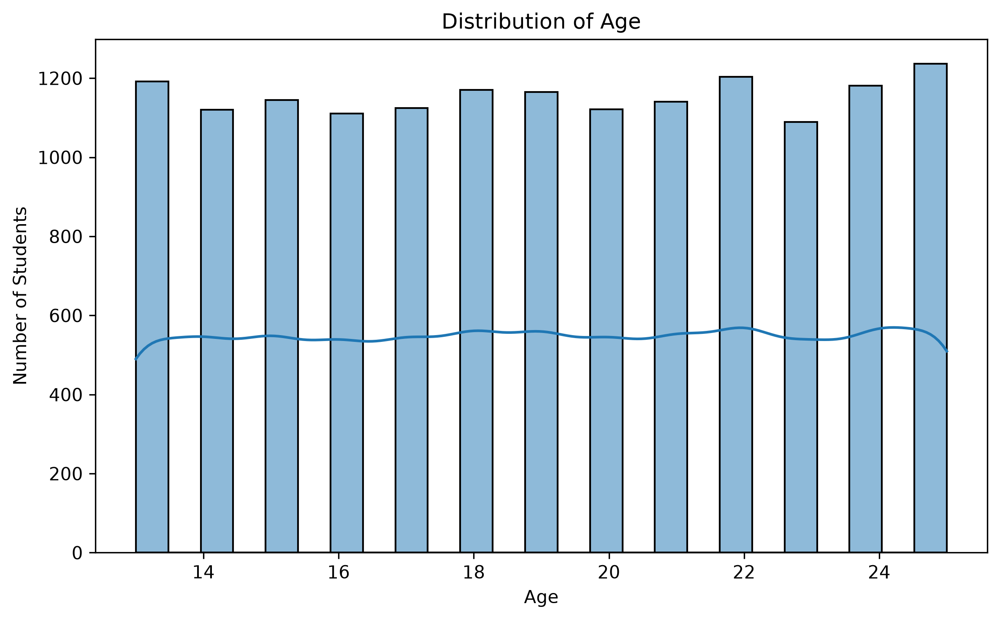
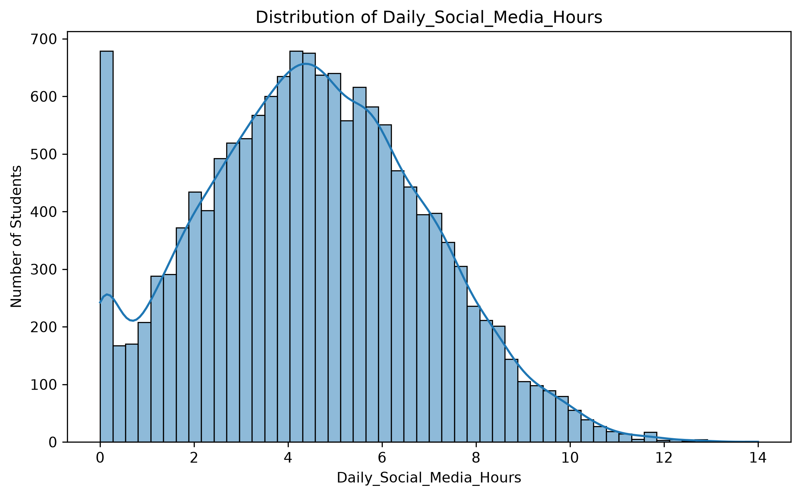
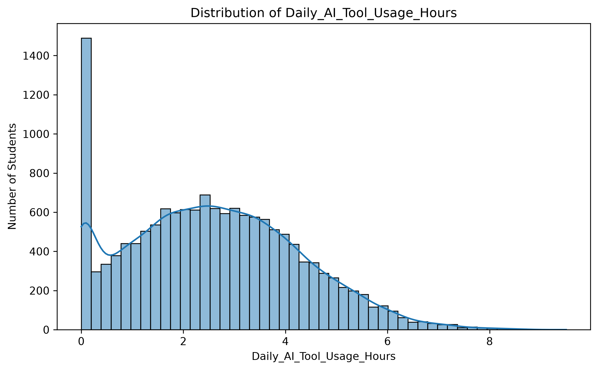
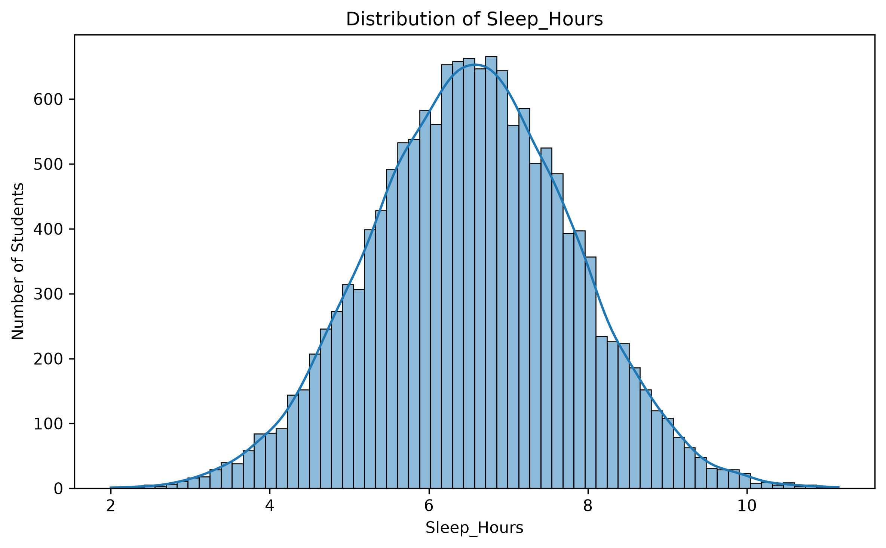
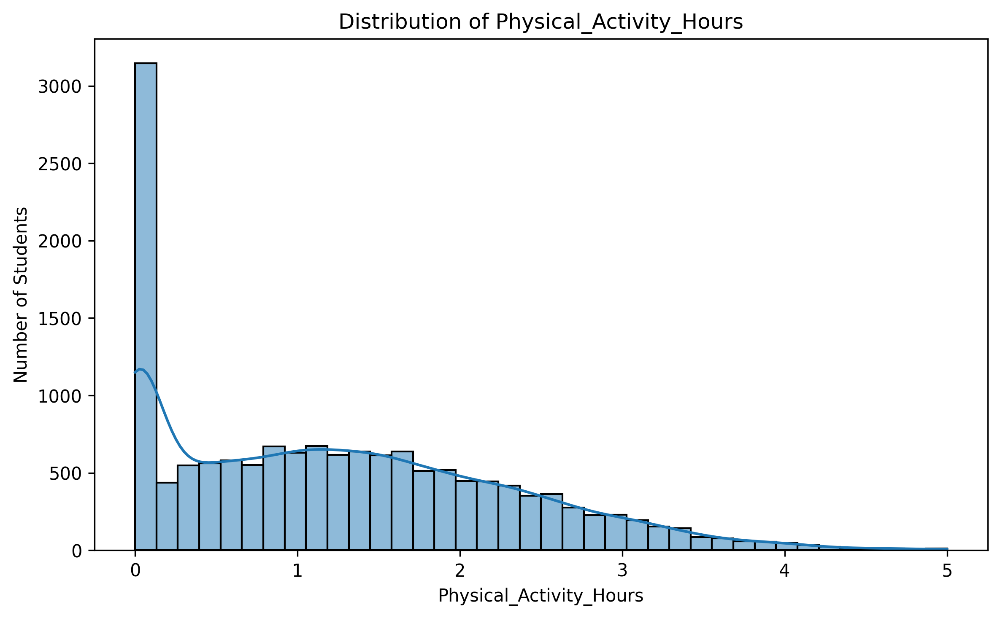
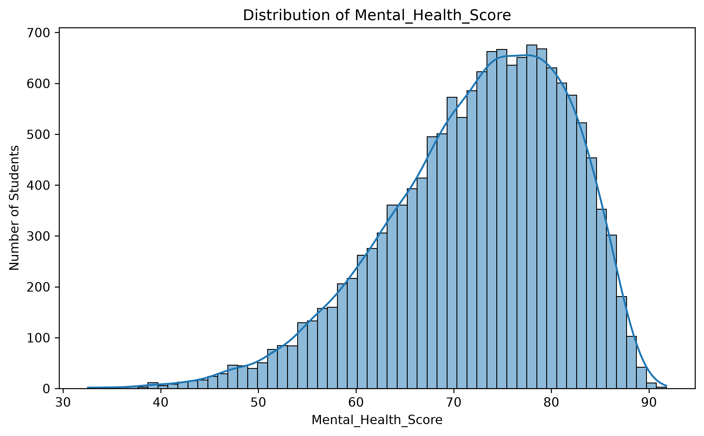
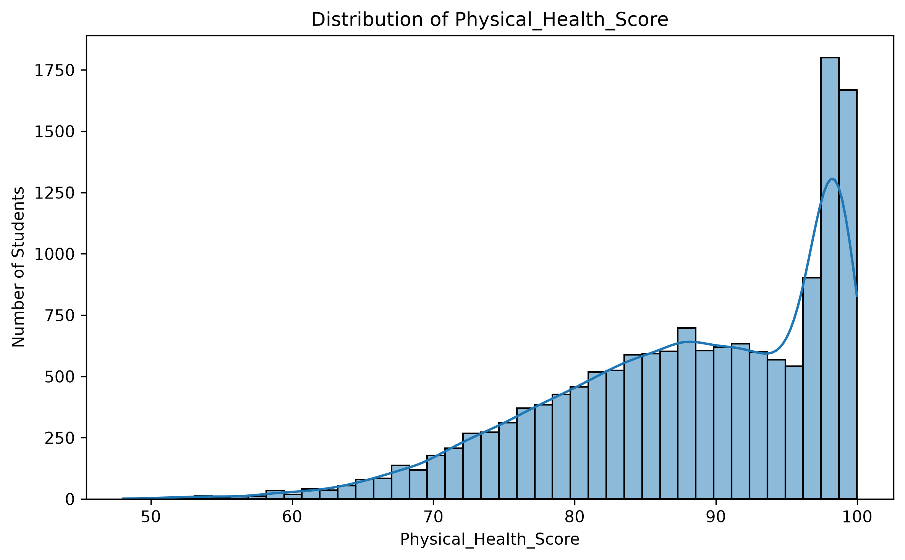
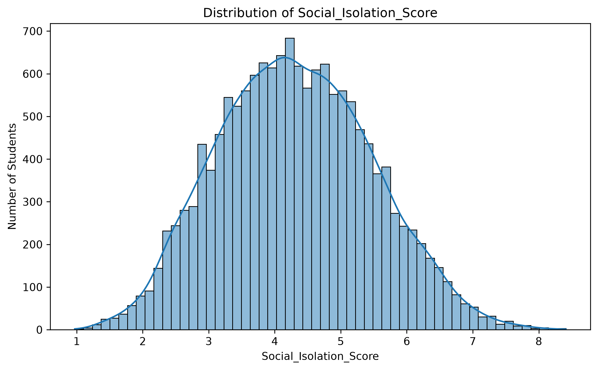
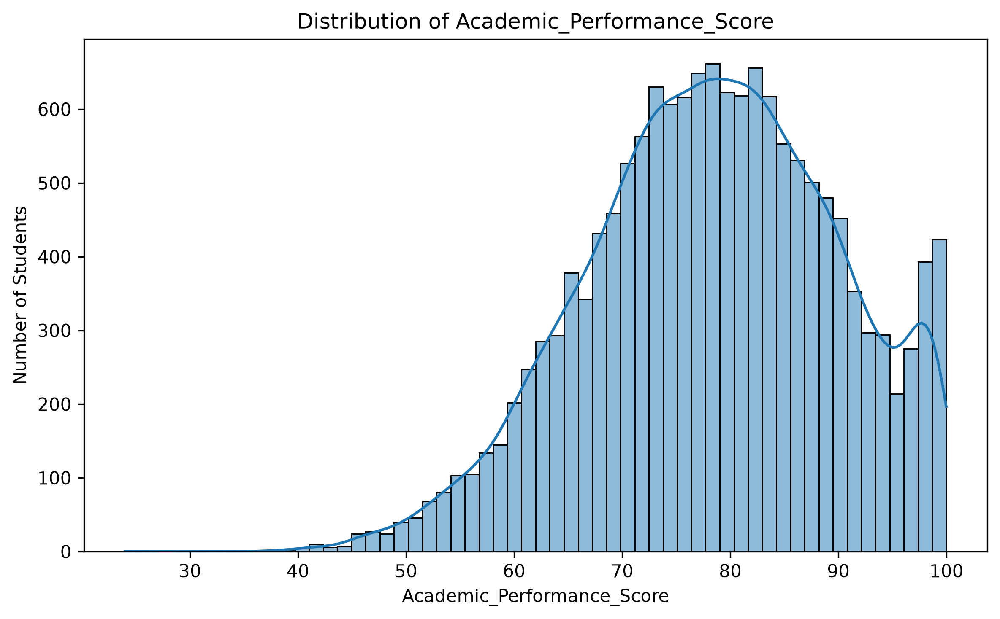
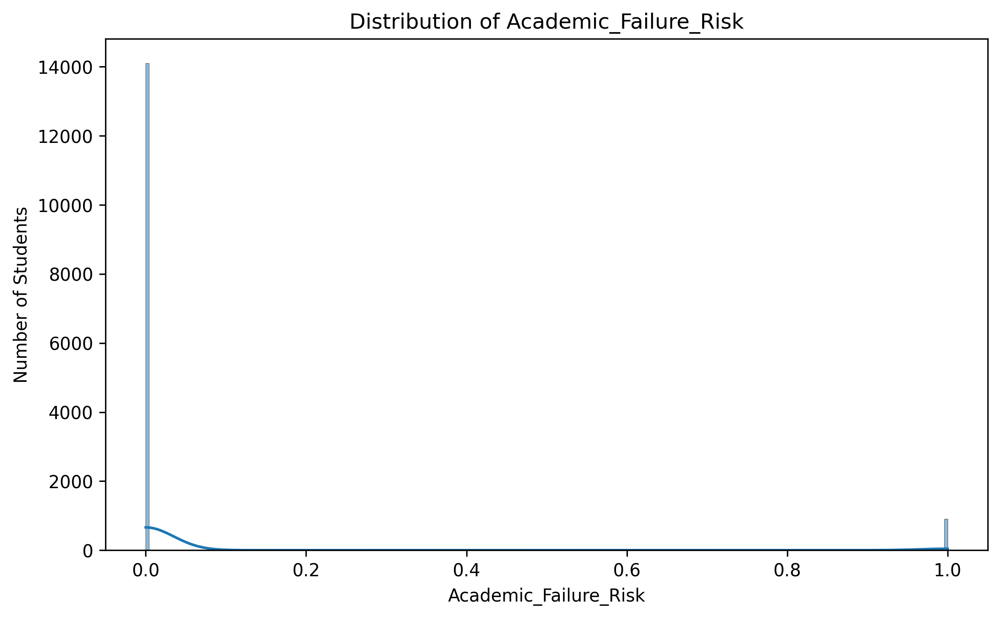

# AI & Social Media Impact on Student Health & Academic Performance

A Python-based data analysis and visualization project that explores the relationship between social media usage, AI tool usage, student health, burnout, and academic performance.

The project analyzes a dataset containing 15,000 student records and 14 variables covering demographics, digital behavior, physical and mental health, social isolation, burnout, and academic performance.

---

## Project Overview

The goal of this project is to explore relationships between students' digital habits and their health and academic outcomes.

The analysis focuses on:

* Social media usage
* AI tool usage
* Sleep duration
* Physical activity
* Mental health
* Physical health
* Social isolation
* Burnout
* Academic performance
* Academic failure risk

The project follows this workflow:

```text
Raw Dataset
     |
     v
Data Loading
     |
     v
Data Inspection
     |
     v
Exploratory Data Analysis
     |
     v
Statistical Analysis
     |
     v
Data Visualization
     |
     v
Correlation Analysis
     |
     v
Feature Engineering
     |
     v
Machine Learning
```

---

## Project Structure

```text
ai-social-media-student-analysis/
│
├── data/
│   ├── raw/
│   │   └── AI_SocialMedia_Student_Health_Dataset_clean.csv
│   │
│   └── processed/
│
├── notebooks/
│
├── src/
│   ├── imports.py
│   ├── load_data.py
│   ├── data_analysis.py
│   └── visualization.py
│
├── reports/
│   └── figures/
│       ├── correlation_heatmap.png
│       ├── boxplot_*.png
│       ├── distribution_*.png
│       └── countplot_*.png
│
├── test.py
├── requirements.txt
└── .gitignore
```

---

## Dataset

The dataset contains:

* 15,000 student records
* 14 columns
* Numerical and categorical variables
* Binary academic failure target

### Dataset Columns

| Column                       | Type        | Description                |
| ---------------------------- | ----------- | -------------------------- |
| `Student_ID`                 | Identifier  | Unique student identifier  |
| `Age`                        | Numerical   | Student age                |
| `Gender`                     | Categorical | Student gender             |
| `Education_Level`            | Categorical | Student education level    |
| `Daily_Social_Media_Hours`   | Numerical   | Daily social media usage   |
| `Daily_AI_Tool_Usage_Hours`  | Numerical   | Daily AI tool usage        |
| `Sleep_Hours`                | Numerical   | Average daily sleep        |
| `Physical_Activity_Hours`    | Numerical   | Daily physical activity    |
| `Mental_Health_Score`        | Numerical   | Mental health score        |
| `Physical_Health_Score`      | Numerical   | Physical health score      |
| `Social_Isolation_Score`     | Numerical   | Social isolation score     |
| `Burnout_Level`              | Categorical | Student burnout level      |
| `Academic_Performance_Score` | Numerical   | Academic performance score |
| `Academic_Failure_Risk`      | Binary      | Academic failure risk      |

---

## Technologies

### Python

The primary programming language used for data analysis, visualization, and machine learning.


### Pandas

Used for loading, cleaning, inspecting, and analyzing the dataset.

### NumPy

Used for numerical calculations and data manipulation.

### Matplotlib

Used to generate statistical and analytical visualizations.

### Seaborn

Used to create statistical graphics such as heatmaps, box plots, histograms, and count plots.

### Scikit-learn

Installed and prepared for the Machine Learning stage of the project.

---

## Installation

Clone the repository:

```bash
git clone https://github.com/aymanaljamal/ai-social-media-student-analysis.git
```

Move into the project directory:

```bash
cd ai-social-media-student-analysis
```

Create a virtual environment:

```bash
python -m venv venv
```

Activate the environment on Windows:

```powershell
.\venv\Scripts\Activate.ps1
```

Install dependencies:

```bash
pip install -r requirements.txt
```

---

## Running the Project

Run:

```bash
python test.py
```

The program currently performs:

1. Dataset loading
2. Dataset inspection
3. Numerical column analysis
4. Categorical column analysis
5. Descriptive statistics
6. Correlation analysis
7. Data visualization
8. Saving generated figures

Generated figures are stored in:

```text
reports/figures/
```

---

# Exploratory Data Analysis

The analysis includes several statistical measurements for numerical variables.

### Numerical Statistics

The project calculates:

* Count
* Mean
* Median
* Minimum
* Maximum
* Standard deviation
* Variance
* Quartiles
* Interquartile range
* Skewness
* Kurtosis

### Dataset Information

The project also checks:

* Number of rows
* Number of columns
* Column names
* Data types
* Missing values
* Duplicate records
* Numerical columns
* Categorical columns
* Unique values

---

# Data Visualization

The project generates several types of visualizations to make the dataset easier to understand.

## Correlation Heatmap

The correlation heatmap shows the relationship between numerical variables.


Correlation values range from:

```text
-1 → Strong negative correlation

 0 → No linear correlation

+1 → Strong positive correlation
```

---

# Box Plots

Box plots are generated for the numerical variables.

They help identify:

* Median
* Quartiles
* Data spread
* Possible outliers

## Age


## Daily Social Media Usage


## Daily AI Tool Usage


## Sleep Hours


## Physical Activity


## Mental Health


## Physical Health


## Social Isolation


## Academic Performance


## Academic Failure Risk


---

# Numerical Distributions

Histograms are used to understand the distribution of numerical variables.

## Age



## Daily Social Media Usage



## Daily AI Tool Usage



## Sleep Hours



## Physical Activity



## Mental Health



## Physical Health



## Social Isolation



## Academic Performance



## Academic Failure Risk



---

# Categorical Analysis

Count plots are generated for the main categorical variables.

## Gender


## Education Level


## Burnout Level


---

# Current Progress

## Project Setup

* [x] Create project structure
* [x] Create virtual environment
* [x] Create `.gitignore`
* [x] Create `requirements.txt`
* [x] Install required libraries

## Data Loading

* [x] Create `imports.py`
* [x] Create `load_data.py`
* [x] Load CSV dataset
* [x] Verify dataset shape
* [x] Display dataset rows

## Exploratory Data Analysis

* [x] Check dataset dimensions
* [x] Check column names
* [x] Check data types
* [x] Identify numerical columns
* [x] Identify categorical columns
* [x] Check missing values
* [x] Check duplicate records
* [x] Calculate count
* [x] Calculate mean
* [x] Calculate median
* [x] Calculate minimum
* [x] Calculate maximum
* [x] Calculate standard deviation
* [x] Calculate variance
* [x] Calculate quartiles
* [x] Calculate IQR
* [x] Calculate skewness
* [x] Calculate kurtosis
* [x] Analyze categorical variables
* [x] Calculate correlations

## Visualization

* [x] Create `visualization.py`
* [x] Correlation heatmap
* [x] Box plots
* [x] Numerical distribution plots
* [x] Categorical count plots
* [x] Save figures automatically
* [x] Store figures in `reports/figures/`
* [x] Exclude `Student_ID` from categorical visualization

## Machine Learning

* [ ] Prepare processed dataset
* [ ] Feature selection
* [ ] Feature engineering
* [ ] Encode categorical variables
* [ ] Prepare features and target
* [ ] Train/test split
* [ ] Build baseline model
* [ ] Logistic Regression
* [ ] Decision Tree
* [ ] Random Forest
* [ ] Model evaluation
* [ ] Accuracy
* [ ] Precision
* [ ] Recall
* [ ] F1-score
* [ ] Confusion Matrix
* [ ] ROC-AUC
* [ ] Compare models
* [ ] Select the best model
* [ ] Save trained model

## Advanced Analysis

* [ ] Analyze social media usage vs academic performance
* [ ] Analyze AI tool usage vs academic performance
* [ ] Analyze sleep vs burnout
* [ ] Analyze mental health vs burnout
* [ ] Analyze social isolation vs burnout
* [ ] Analyze burnout vs academic performance
* [ ] Identify important predictors of academic failure
* [ ] Build an academic failure risk prediction model

---

# Machine Learning Objective

The main Machine Learning objective is to predict:

```text
Academic_Failure_Risk
```

The target variable is binary:

```text
0 → No Academic Failure Risk

1 → Academic Failure Risk
```

Potential features include:

```text
Age
Gender
Education_Level
Daily_Social_Media_Hours
Daily_AI_Tool_Usage_Hours
Sleep_Hours
Physical_Activity_Hours
Mental_Health_Score
Physical_Health_Score
Social_Isolation_Score
Burnout_Level
Academic_Performance_Score
```

The project will compare multiple classification algorithms and evaluate their performance using standard classification metrics.

---

# Dataset Source

The cleaned dataset used in this project is stored locally in:

```text
data/raw/AI_SocialMedia_Student_Health_Dataset_clean.csv
```

The generated visualizations are available here:

[View all project figures](https://github.com/aymanaljamal/ai-social-media-student-analysis/tree/main/reports/figures)

The original dataset source will be added here once the original dataset URL is confirmed.

---

# Important Note

This project is intended for educational and analytical purposes.

Correlation does not necessarily imply causation. Relationships identified during the analysis should therefore be interpreted as statistical associations rather than direct causal effects.

---

# Project Status

Current stage:

```text
Project Setup
      |
      v
Data Loading
      |
      v
Exploratory Data Analysis
      |
      v
Data Visualization
      |
      v
Correlation Analysis
      |
      v
NEXT: Data Preprocessing
      |
      v
Machine Learning
```

The project is currently ready to move from Exploratory Data Analysis and Visualization into the Data Preprocessing and Machine Learning stages.

---

## Author

Ayman Al-Jamal

GitHub: https://github.com/aymanaljamal

Repository: https://github.com/aymanaljamal/ai-social-media-student-analysis
