<div align="center">

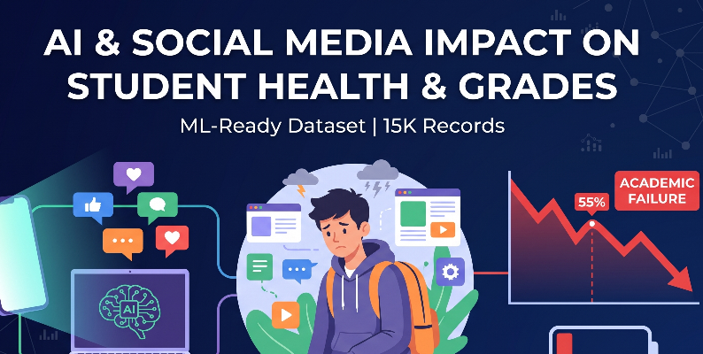

# AI & Social Media Impact on Student Health & Academic Performance

### Data Analysis, Visualization, Data Cleaning, and Machine Learning Project

<p>

<a href="https://github.com/aymanaljamal/ai-social-media-student-analysis">
Repository
</a>
&nbsp; | &nbsp;
<a href="https://www.kaggle.com/datasets/debayank2024/ai-and-social-media-impact-student-health-and-grades">
Dataset
</a>
&nbsp; | &nbsp;
<a href="https://github.com/aymanaljamal/ai-social-media-student-analysis/tree/main/reports/figures">
Visualizations
</a>

</p>

</div>

---

# 📌 Project Overview

This project explores the relationship between **social media usage, AI tool usage, student health, burnout, social isolation, and academic performance**.

The project uses Python and common Data Science libraries to build a complete and reproducible data analysis workflow.

The dataset contains approximately **15,000 student records** and **14 variables** covering:

* Demographic information
* Social media usage
* AI tool usage
* Sleep
* Physical activity
* Mental health
* Physical health
* Social isolation
* Burnout
* Academic performance
* Academic failure risk

The project is being developed step by step, starting with data exploration and visualization and progressing toward data preprocessing and Machine Learning.

---

# 🎯 Project Goals

The main goals are to understand how students' digital behavior and lifestyle factors relate to their health and academic outcomes.

The analysis focuses on:

* Daily social media usage
* Daily AI tool usage
* Sleep duration
* Physical activity
* Mental health
* Physical health
* Social isolation
* Burnout
* Academic performance
* Academic failure risk

The final Machine Learning objective is to build a model capable of predicting **Academic Failure Risk**.

---

# 🔄 Project Workflow

The project follows a structured Data Science workflow:

```text
Raw Dataset
     |
     v
Data Loading
     |
     v
Data Exploration
     |
     v
Exploratory Data Analysis
     |
     v
Statistical Analysis
     |
     v
Data Visualization
     |
     v
Correlation Analysis
     |
     v
Data Cleaning
     |
     v
Data Preprocessing
     |
     v
Feature Engineering
     |
     v
Machine Learning
     |
     v
Model Evaluation
```

---

# 📊 Dataset

The project uses the following public Kaggle dataset:

**AI & Social Media Impact: Student Health & Grades**

The original dataset is available on Kaggle:

[View Dataset on Kaggle](https://www.kaggle.com/datasets/debayank2024/ai-and-social-media-impact-student-health-and-grades)

The original raw dataset is stored locally in:

```text
data/raw/
```

The cleaned dataset is generated and stored in:

```text
data/processed/
```

### Dataset Statistics

| Property              |                   Value |
| --------------------- | ----------------------: |
| Records               |                  15,000 |
| Columns               |                      14 |
| Numerical Variables   |                      10 |
| Categorical Variables |                       3 |
| Identifier            |                       1 |
| Target Variable       | `Academic_Failure_Risk` |

---

# 📋 Dataset Columns

| Column                       | Type        | Description                |
| ---------------------------- | ----------- | -------------------------- |
| `Student_ID`                 | Identifier  | Unique student identifier  |
| `Age`                        | Numerical   | Student age                |
| `Gender`                     | Categorical | Student gender             |
| `Education_Level`            | Categorical | Student education level    |
| `Daily_Social_Media_Hours`   | Numerical   | Daily social media usage   |
| `Daily_AI_Tool_Usage_Hours`  | Numerical   | Daily AI tool usage        |
| `Sleep_Hours`                | Numerical   | Average daily sleep        |
| `Physical_Activity_Hours`    | Numerical   | Daily physical activity    |
| `Mental_Health_Score`        | Numerical   | Mental health score        |
| `Physical_Health_Score`      | Numerical   | Physical health score      |
| `Social_Isolation_Score`     | Numerical   | Social isolation score     |
| `Burnout_Level`              | Categorical | Student burnout level      |
| `Academic_Performance_Score` | Numerical   | Academic performance score |
| `Academic_Failure_Risk`      | Binary      | Academic failure risk      |

---

# 📁 Project Structure

```text
ai-social-media-student-analysis/
│
├── .github/
│   ├── ISSUE_TEMPLATE/
│   │   ├── bug_report.md
│   │   └── feature_request.md
│   │
│   └── PULL_REQUEST_TEMPLATE.md
│
├── data/
│   ├── raw/
│   │   └── AI_SocialMedia_Student_Health_Dataset.csv
│   │
│   └── processed/
│       └── AI_SocialMedia_Student_Health_Dataset_clean.csv
│
├── notebooks/
│   ├── 01_1_data_exploration.ipynb
│   ├── 01_2_data_exploration.ipynb
│   └── 01_3_data_exploration.ipynb
│
├── reports/
│   └── figures/
│       ├── dataset-cover.png
│       ├── correlation_heatmap.png
│       ├── boxplot_*.png
│       ├── distribution_*.png
│       └── countplot_*.png
│
├── src/
│   ├── imports.py
│   ├── data_loader.py
│   ├── data_cleaning.py
│   ├── data_analysis.py
│   └── visualization.py
│
├── tests/
│
├── CHANGELOG.md
├── CODE_OF_CONDUCT.md
├── CONTRIBUTING.md
├── LICENSE
├── PROJECT_DOCUMENTATION.md
├── README.md
├── SECURITY.md
├── requirements.txt
├── test.py
└── .gitignore
```

---

# 📓 Data Exploration Notebooks

The project currently contains three notebooks for exploring the dataset.

## `01_1_data_exploration.ipynb`

The first exploration notebook focuses on the initial understanding of the dataset.

It includes areas such as:

* Loading the dataset
* Inspecting the dataset
* Checking dimensions
* Viewing column names
* Checking data types
* Viewing sample records
* Identifying numerical columns
* Identifying categorical columns

---

## `01_2_data_exploration.ipynb`

The second notebook focuses on statistical and categorical exploration.

It includes:

* Missing-value analysis
* Duplicate analysis
* Unique-value analysis
* Descriptive statistics
* Numerical variable analysis
* Categorical variable analysis
* Distribution inspection

---

## `01_3_data_exploration.ipynb`

The third notebook focuses on relationships between variables and visualization.

It includes:

* Correlation analysis
* Correlation heatmaps
* Numerical distributions
* Box plots
* Categorical count plots
* Visual exploration of important variables

The notebooks are intended to document the analysis process step by step.

---

# 🧹 Data Cleaning

A dedicated data-cleaning pipeline has been added to the project.

The cleaning logic is implemented in:

```text
src/data_cleaning.py
```

The data loading logic is separated into:

```text
src/data_loader.py
```

This separation keeps the project modular and easier to maintain.

### Current Cleaning Steps

The cleaning pipeline performs:

1. Load the raw dataset.
2. Clean column names.
3. Clean text values.
4. Remove duplicate rows.
5. Convert numerical columns.
6. Handle missing values.
7. Validate numerical ranges.
8. Perform a final data check.
9. Save the cleaned dataset.

The cleaned dataset is saved to:

```text
data/processed/AI_SocialMedia_Student_Health_Dataset_clean.csv
```

The original raw dataset is not overwritten.

---

# 🔎 Exploratory Data Analysis

The project performs an initial inspection before moving to Machine Learning.

The analysis includes:

* Number of rows
* Number of columns
* Column names
* Data types
* Missing values
* Duplicate records
* Unique values
* Numerical columns
* Categorical columns
* Descriptive statistics
* Correlations

---

# 📈 Descriptive Statistics

For numerical variables, the project analyzes:

* Count
* Mean
* Median
* Minimum
* Maximum
* Standard deviation
* Variance
* Quartiles
* Interquartile range
* Skewness
* Kurtosis

---

# 📊 Data Visualization

Generated visualizations are stored in:

```text
reports/figures/
```

The project currently includes:

* Correlation heatmaps
* Box plots
* Numerical distribution plots
* Histograms
* Categorical count plots

---

# 🔥 Correlation Heatmap

The correlation heatmap is used to investigate relationships between numerical variables.

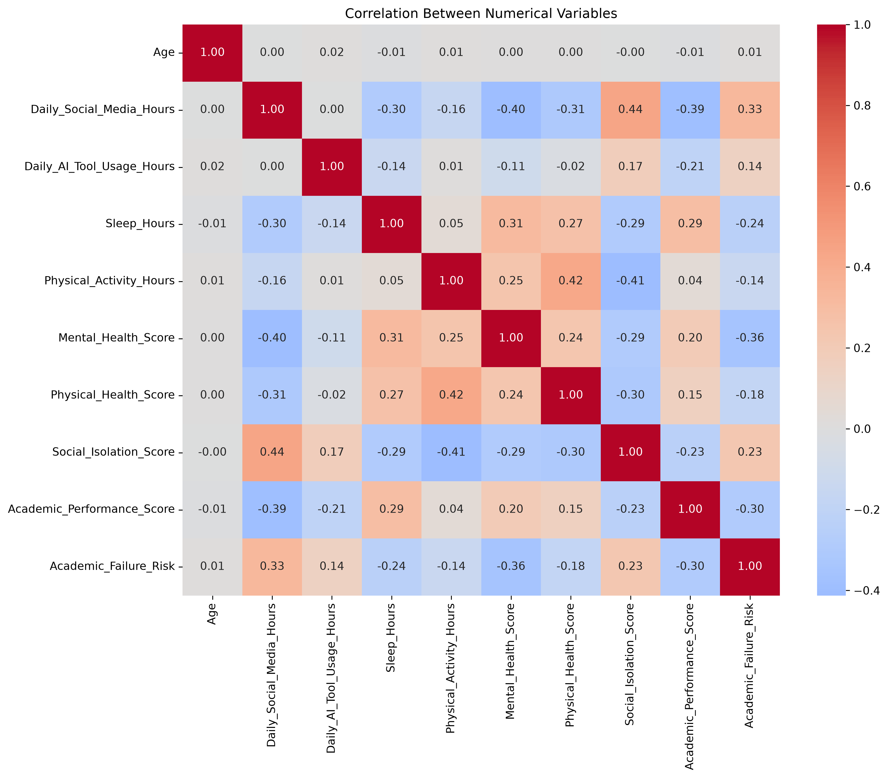

The analysis examines relationships involving variables such as:

* Social media usage
* AI tool usage
* Sleep
* Mental health
* Physical health
* Social isolation
* Academic performance

---

# 📦 Box Plots

Box plots are used to examine:

* Median
* Quartiles
* Data spread
* Potential outliers

Examples include:

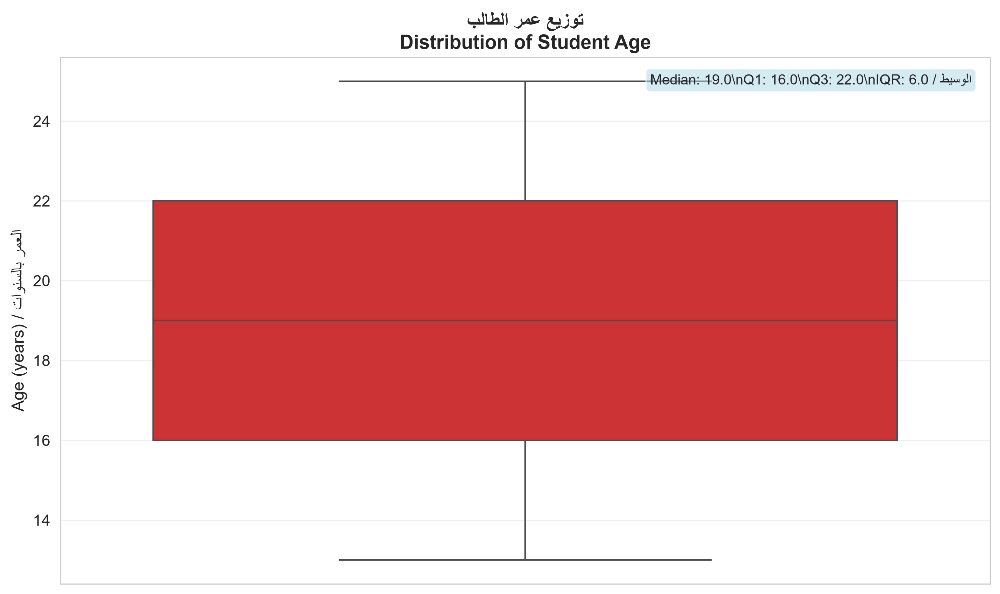

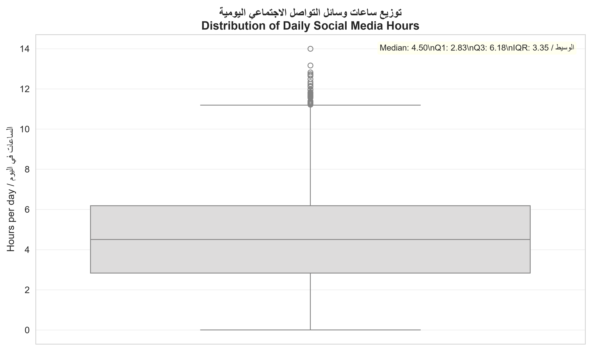

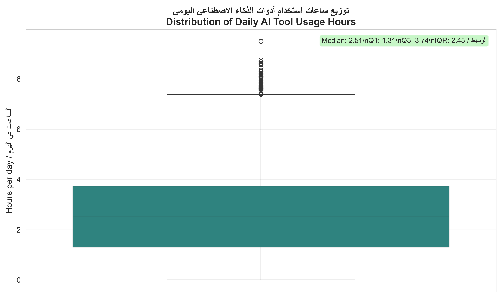

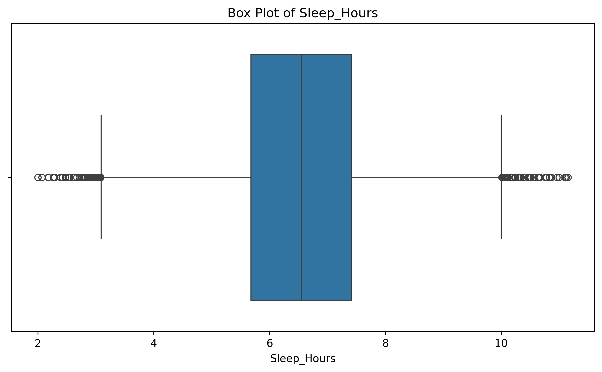

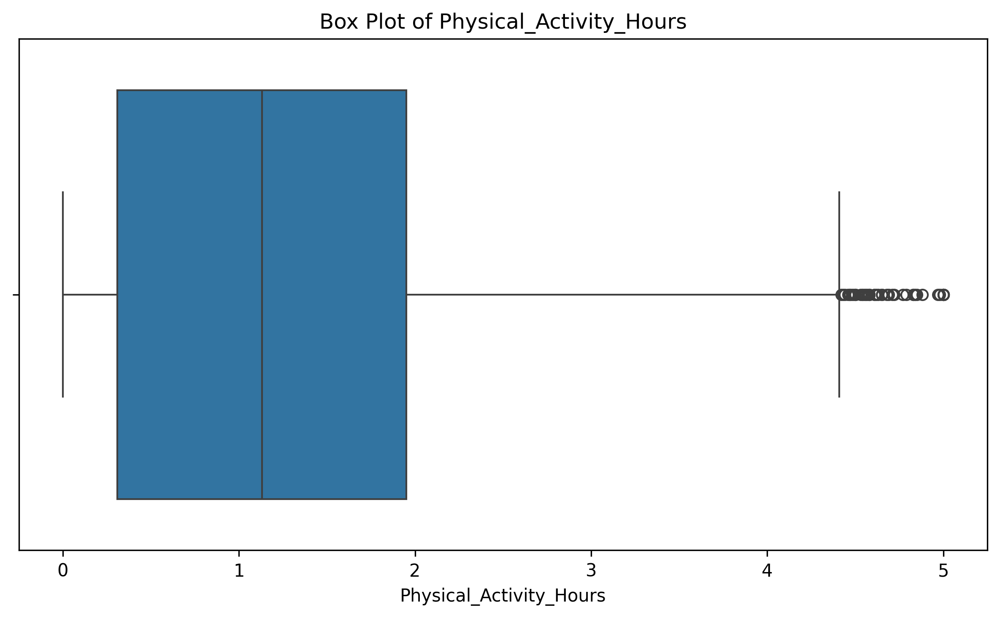

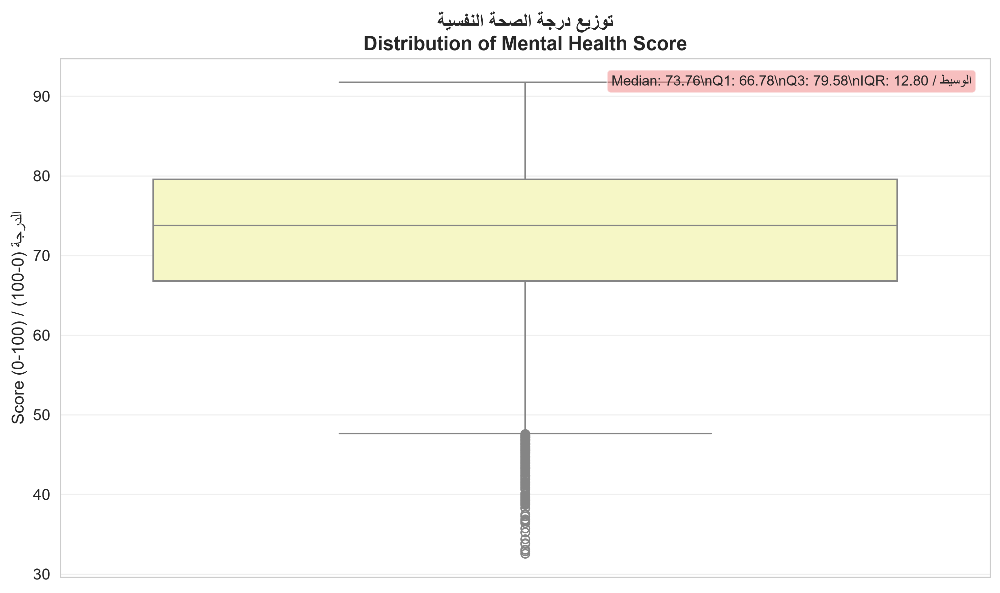

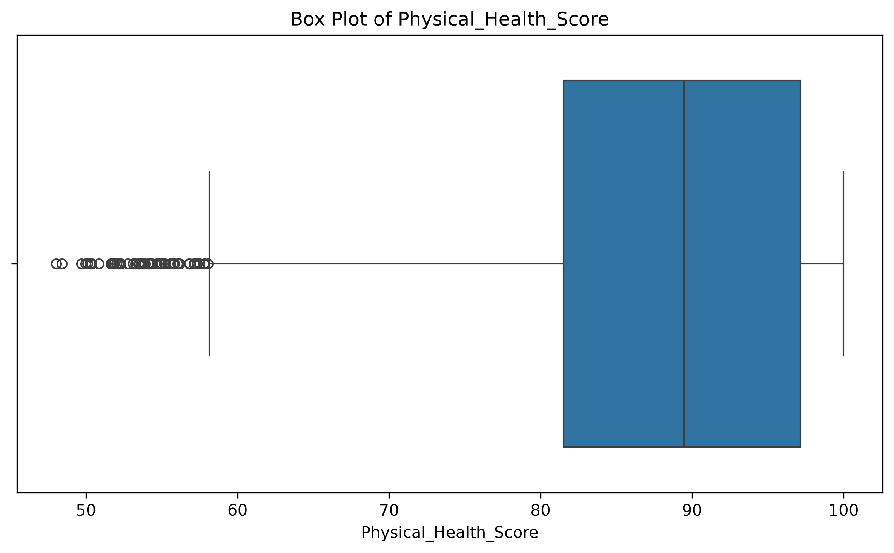

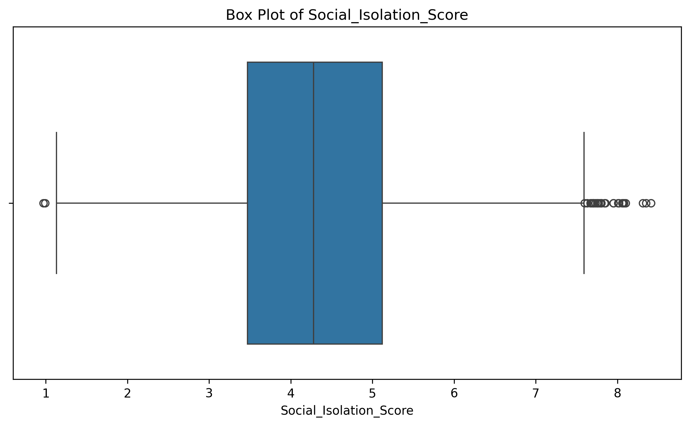

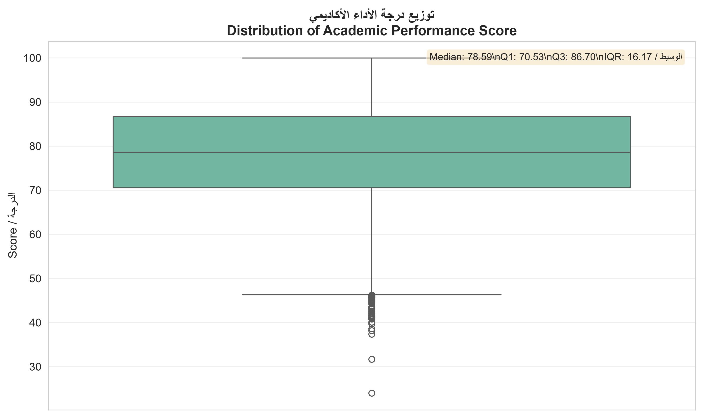

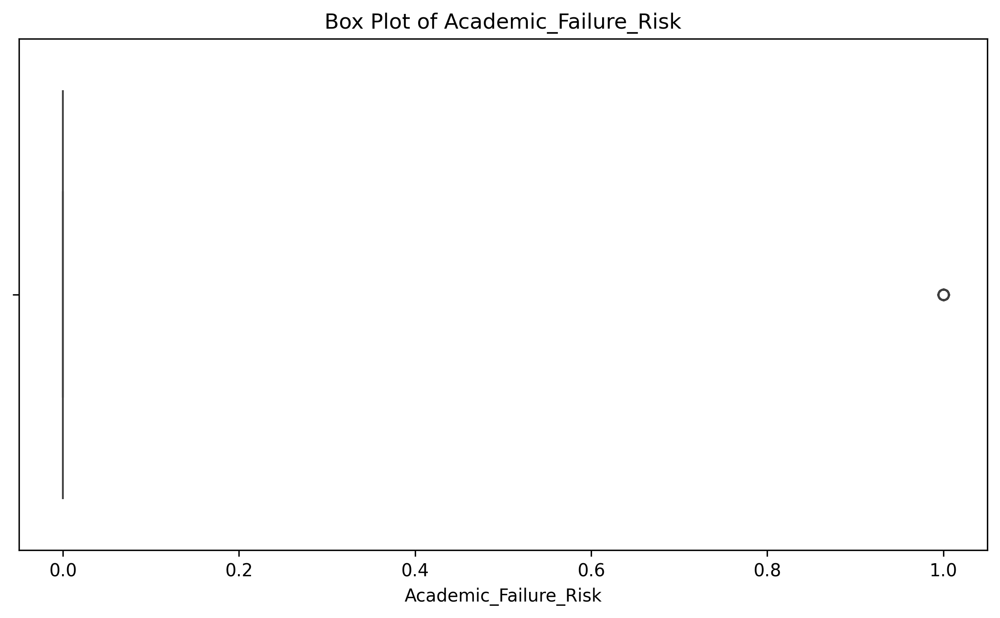

---

# 📉 Numerical Distributions

Histograms and distribution plots are used to understand how numerical variables are distributed.

Examples include:

* Age
* Social media usage
* AI tool usage
* Sleep
* Physical activity
* Mental health
* Physical health
* Social isolation
* Academic performance
* Academic failure risk

---

# 🧑‍🎓 Categorical Analysis

Categorical variables are analyzed using count plots.

Current categorical analysis includes:

### Gender

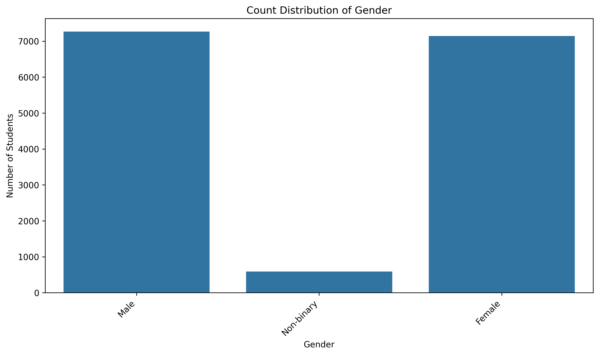

### Education Level

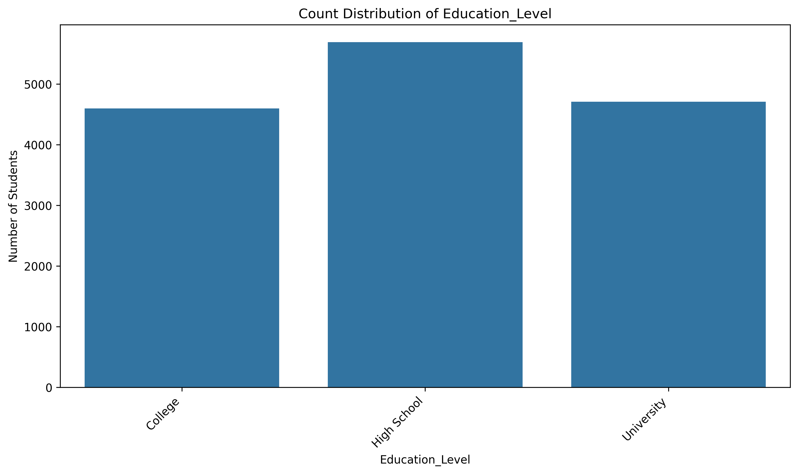

### Burnout Level

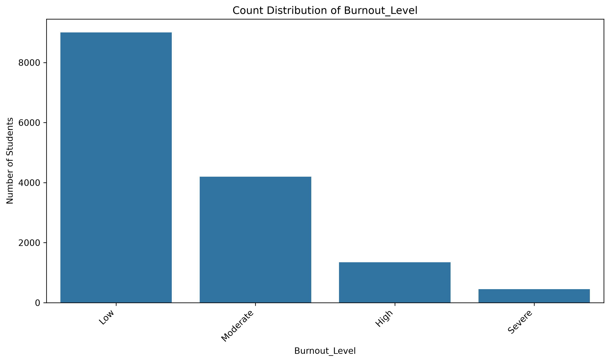

`Student_ID` is treated as an identifier and is excluded from categorical visualization.

---

# 🤖 Machine Learning Objective

The primary Machine Learning objective is to predict:

```text
Academic_Failure_Risk
```

This is a binary classification problem:

```text
0 → No Academic Failure Risk
1 → Academic Failure Risk
```

Potential input features include:

```text
Age
Gender
Education_Level
Daily_Social_Media_Hours
Daily_AI_Tool_Usage_Hours
Sleep_Hours
Physical_Activity_Hours
Mental_Health_Score
Physical_Health_Score
Social_Isolation_Score
Burnout_Level
Academic_Performance_Score
```

Potential models include:

* Logistic Regression
* Decision Tree
* Random Forest

---

# 📏 Model Evaluation

The Machine Learning models will be evaluated using:

* Accuracy
* Precision
* Recall
* F1-score
* Confusion Matrix
* ROC-AUC

Models will be compared to identify the most suitable approach for predicting academic failure risk.

---

# ❓ Research Questions

## Digital Behavior

* Does higher social media usage relate to academic performance?
* Is AI tool usage associated with academic performance?
* How are social media and AI usage distributed among students?

## Health

* Is sleep duration related to burnout?
* Is physical activity associated with mental health?
* Is mental health related to academic performance?

## Social Factors

* Is social isolation associated with burnout?
* Is social isolation related to academic performance?

## Burnout

* How does burnout vary among students?
* Is burnout associated with academic performance?
* Can burnout help predict academic failure risk?

## Machine Learning

* Which variables are the strongest predictors of academic failure?
* Which classification model performs best?
* How accurately can academic failure risk be predicted?

---

# 🛠️ Technologies

## Python

Primary programming language used throughout the project.

## Pandas

Used for:

* Loading datasets
* DataFrame manipulation
* Data inspection
* Data cleaning
* Statistical analysis

## NumPy

Used for:

* Numerical operations
* Statistical calculations
* Numerical data processing

## Matplotlib

Used for creating and saving visualizations.

## Seaborn

Used for statistical visualizations such as:

* Heatmaps
* Box plots
* Histograms
* Count plots

## Scikit-learn

Used for the Machine Learning stage, including:

* Data splitting
* Encoding
* Feature scaling
* Classification
* Model evaluation

## Jupyter Notebook

Used for interactive and documented exploratory data analysis.

---

# ⚙️ Installation

Clone the repository:

```bash
git clone https://github.com/aymanaljamal/ai-social-media-student-analysis.git
```

Move into the project directory:

```bash
cd ai-social-media-student-analysis
```

Create a virtual environment:

```bash
python -m venv venv
```

Activate it on Windows:

```powershell
.\venv\Scripts\Activate.ps1
```

Install dependencies:

```bash
pip install -r requirements.txt
```

---

# ▶️ Running the Project

## Run Data Cleaning

The cleaning pipeline can be executed with:

```bash
python src/data_cleaning.py
```

The cleaned dataset will be generated inside:

```text
data/processed/
```

---

## Run the Test Script

```bash
python test.py
```

---

## Run the Notebooks

Open Jupyter Notebook:

```bash
jupyter notebook
```

Then navigate to:

```text
notebooks/
```

and open:

```text
01_1_data_exploration.ipynb
01_2_data_exploration.ipynb
01_3_data_exploration.ipynb
```

---

# 📚 Documentation

The project contains additional documentation:

| File                       | Purpose                                     |
| -------------------------- | ------------------------------------------- |
| `PROJECT_DOCUMENTATION.md` | Detailed technical project documentation    |
| `CHANGELOG.md`             | Project changes and development history     |
| `CONTRIBUTING.md`          | Contribution guidelines                     |
| `CODE_OF_CONDUCT.md`       | Community behavior guidelines               |
| `SECURITY.md`              | Security and vulnerability reporting policy |
| `LICENSE`                  | MIT open-source license                     |

---

# 🚧 Project Progress

## Project Setup

* [x] Create project structure
* [x] Create virtual environment
* [x] Create `.gitignore`
* [x] Create `requirements.txt`
* [x] Install required libraries

## Data Loading

* [x] Create `imports.py`
* [x] Create `data_loader.py`
* [x] Load CSV dataset
* [x] Verify dataset shape

## Data Exploration

* [x] Create `01_1_data_exploration.ipynb`
* [x] Create `01_2_data_exploration.ipynb`
* [x] Create `01_3_data_exploration.ipynb`
* [x] Inspect dataset dimensions
* [x] Inspect column names
* [x] Check data types
* [x] Identify numerical columns
* [x] Identify categorical columns
* [x] Check missing values
* [x] Check duplicate records
* [x] Analyze unique values
* [x] Calculate descriptive statistics
* [x] Calculate correlations
* [x] Analyze categorical variables

## Visualization

* [x] Create correlation heatmap
* [x] Create box plots
* [x] Create numerical distribution plots
* [x] Create categorical count plots
* [x] Save figures automatically
* [x] Store figures in `reports/figures/`
* [x] Exclude `Student_ID` from categorical visualization

## Data Cleaning

* [x] Create `data_cleaning.py`
* [x] Create `data_loader.py`
* [x] Clean column names
* [x] Clean text values
* [x] Remove duplicate rows
* [x] Convert numerical columns
* [x] Handle missing values
* [x] Validate numerical values
* [x] Create processed data directory
* [x] Save cleaned dataset

## Data Preprocessing

* [ ] Check outliers
* [ ] Encode categorical variables
* [ ] Feature scaling
* [ ] Feature selection
* [ ] Feature engineering
* [ ] Finalize ML-ready dataset

## Machine Learning

* [ ] Prepare features and target
* [ ] Train/test split
* [ ] Build baseline model
* [ ] Logistic Regression
* [ ] Decision Tree
* [ ] Random Forest
* [ ] Model evaluation
* [ ] Accuracy
* [ ] Precision
* [ ] Recall
* [ ] F1-score
* [ ] Confusion Matrix
* [ ] ROC-AUC
* [ ] Compare models
* [ ] Select best model
* [ ] Save trained model

## Advanced Analysis

* [ ] Analyze social media usage vs academic performance
* [ ] Analyze AI tool usage vs academic performance
* [ ] Analyze sleep vs burnout
* [ ] Analyze mental health vs burnout
* [ ] Analyze social isolation vs burnout
* [ ] Analyze burnout vs academic performance
* [ ] Identify important predictors of academic failure
* [ ] Build academic failure risk prediction model

---

# 📌 Project Status

Current stage:

```text
Project Setup
      |
      v
Data Loading
      |
      v
Data Exploration
      |
      v
Exploratory Data Analysis
      |
      v
Data Visualization
      |
      v
Correlation Analysis
      |
      v
Data Cleaning
      |
      v
CURRENT STAGE
      |
      v
Data Preprocessing
      |
      v
Feature Engineering
      |
      v
Machine Learning
      |
      v
Model Evaluation
```

The project has completed the initial **Data Exploration, Visualization, and Data Cleaning** stages.

The next major stage is **Data Preprocessing and Machine Learning**.

---

# 📖 Dataset Source

Original dataset:

**AI & Social Media Impact: Student Health & Grades**

Kaggle:

https://www.kaggle.com/datasets/debayank2024/ai-and-social-media-impact-student-health-and-grades

Project repository:

https://github.com/aymanaljamal/ai-social-media-student-analysis

---

# ⚠️ Important Note

This project is intended for educational and analytical purposes.

Correlation does not necessarily imply causation.

A statistical relationship between two variables should not automatically be interpreted as evidence that one variable directly causes the other.

Machine Learning predictions should also be evaluated carefully and should not be used as the sole basis for real-world decisions.

---

# 📄 License

This project is licensed under the **MIT License**.

See the `LICENSE` file for details.

---

# 👨‍💻 Author

**Ayman Al-Jamal**

GitHub:

https://github.com/aymanaljamal

Repository:

https://github.com/aymanaljamal/ai-social-media-student-analysis
